I. Exploration locale en solo

🌞 Affichez les infos des cartes réseau de votre PC

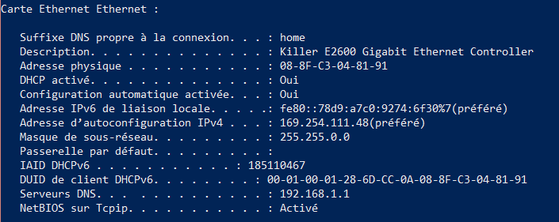
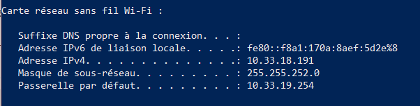

nom, adresse MAC et adresse IP de l'interface WiFi

  Description. . . . . . . . . . . . . . : Killer(R) Wi-Fi 6 AX1650i 160MHz Wireless Network Adapter (201NGW)
   Adresse physique . . . . . . . . . . . : 58-6C-25-82-7A-85
    Adresse IPv4. . . . . . . . . . . . . .: 10.33.18.124

nom, adresse MAC et adresse IP de l'interface Ethernet

  Description. . . . . . . . . . . . . . : Bluetooth Device (Personal Area Network) #2
   Adresse physique . . . . . . . . . . . : 58-6C-25-82-7A-89
   Pas d'adresse ip car non utilisé

 🌞 Affichez votre gateway

 Passerelle par défaut. . . . . . . . . : 10.33.19.254

 🌞 Trouvez comment afficher les informations sur une carte IP (change selon l'OS)

 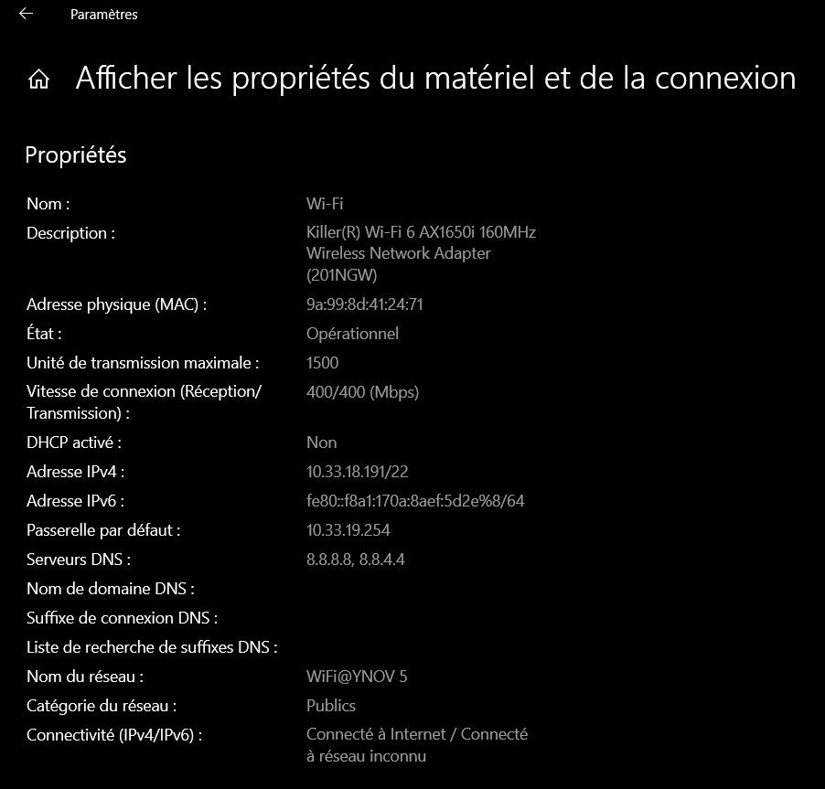

Chemin pour accéder aux informations sur une carte ip:

Aller dans les parametres windows-> Réseau et internet -> Wifi -> Propriétés du matériel

Adresse IPv4 :	10.33.18.124
Adresse physique (MAC) :	58-6C-25-82-7A-85

Pour afficher la gateway
Aller dans les parametres windows-> Réseau et internet -> Etat-> Afficher les Propriétés du matériel et de la connexion

Passerelle par défaut: 10.33.19.254

🌞 à quoi sert la gateway dans le réseau d'YNOV ?

A faire passer le reseau privé en public

🌞 Utilisez l'interface graphique de votre OS pour changer d'adresse IP :

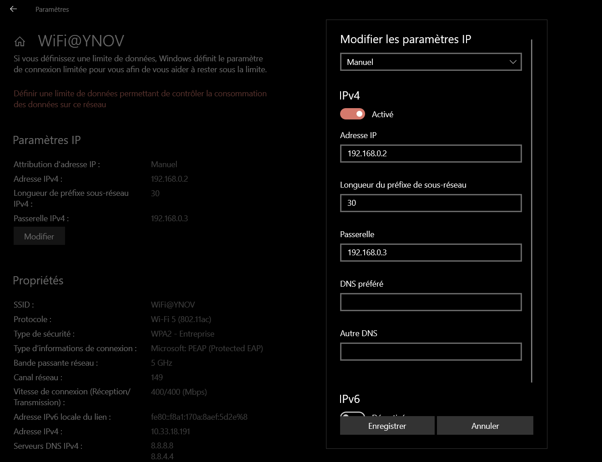

il est possible de perdre la connexion si l'ip nouveau choisi est déjà utilisé par un autre client

II. Exploration locale en duo

🌞 pour tester la connectivité à internet on fait souvent des requêtes simples vers un serveur internet connu
encore une fois, un ping vers un DNS connu comme 1.1.1.1 ou 8.8.8.8 c'est parfait

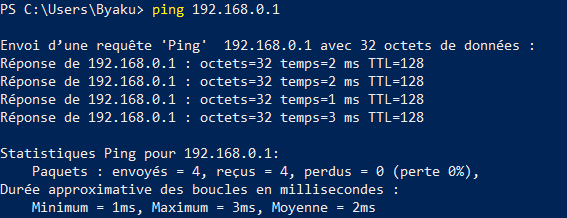

Utilisation d'un des deux comme gateway

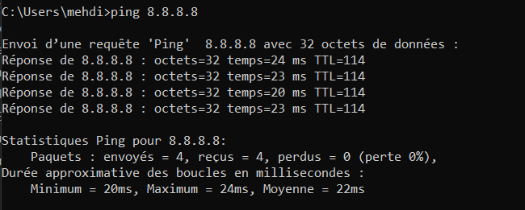

🌞 utiliser un traceroute ou tracert pour bien voir que les requêtes passent par la passerelle choisie (l'autre le PC)

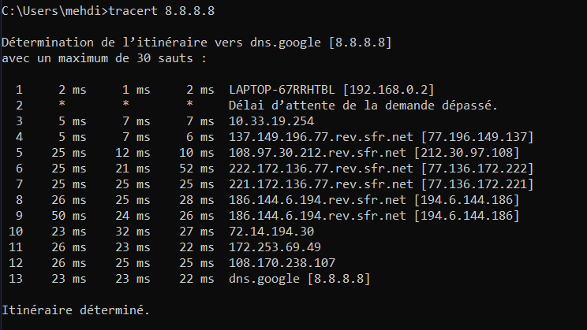

Petit chat privé

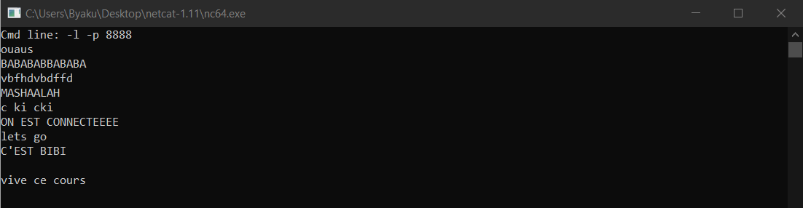

Firewall

🌞 Autoriser les ping

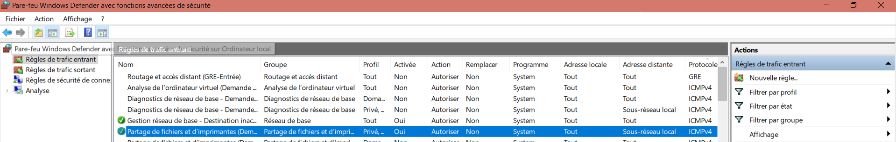

🌞 Autoriser le traffic sur le port qu'utilise nc

III. Manipulations d'autres outils/protocoles côté client

🌞Exploration du DHCP, depuis votre PC

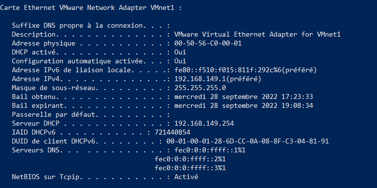

🌞 trouver l'adresse IP du serveur DNS que connaît votre ordinateur

🌞 utiliser, en ligne de commande l'outil nslookup (Windows, MacOS) ou dig (GNU/Linux, MacOS) pour faire des requêtes DNS à la main

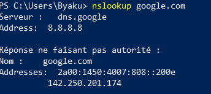

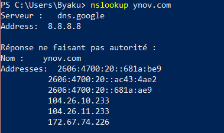

IV. Wireshark

🌞 utilisez le pour observer les trames qui circulent entre vos deux carte Ethernet. Mettez en évidence 

